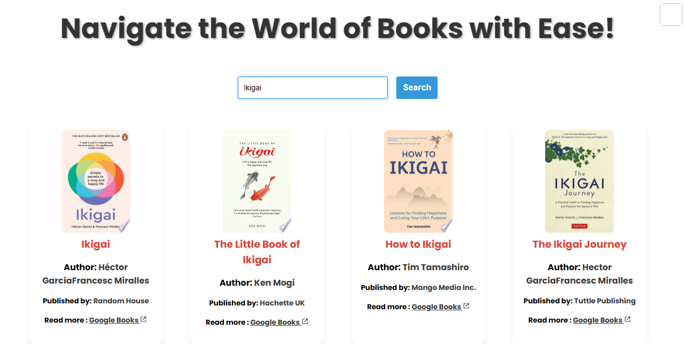
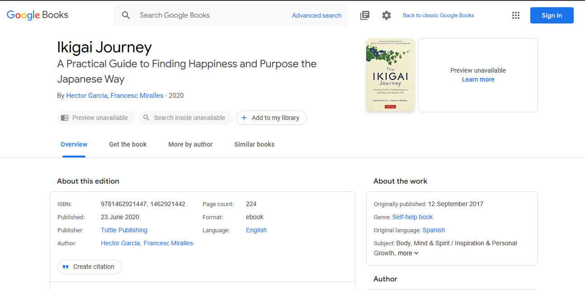

<div align="center">
  <h2 align = "center">Infinite Chapters</h2>
  <h4 align = "center">A Book Finder app built with React that utilizes the Google Books API for fetching books...</h4>

 
</div>

### API

- [Google Books API](https://developers.google.com/books/docs/v1/using)

### Clone this repository
```bash
git clone https://github.com/Balaatchayar/Infinite_Chapters
```

### Installation
 1. Run this command in your terminal: ```npm install```
 2. In the project directory, you can run: ``` npm start ```
 3. Builds the app for production to the build folder: ```npm run build```







